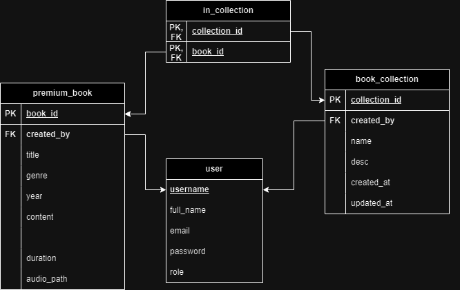

# REST_IF3110-2023-02-10

# Langkah-langkah jalan
1. docker compose up -d
2. npx prisma generate
3. npm run build
4. npm run dev

# Audi-rest: The Backend for AudiBook

## Introduction

Audi-REST adalah backend dari aplikasi AudiBook (khususnya AudiBook premium). Aplikasi ini dibuat dengan menggunaan Express + Typescript + MySQL. Aplikasi ini dibuat untuk memenuhi tugas besar milestone 2 mata kuliah Pemrograman Aplikasi Berbasis Web.

## Overview Feature

- Express with Typescript based app
- Authentication using JWT
- MySQL as database
- Dockerized
- SOAP calls to soap-service

## Skema basis data

Basis data terdiri atas 3 entitas, yaitu tabel users, tabel book_collection, dan tabel premium_boo. Tabel users menyimpan informasi mengenai user yang terdiri dari 2 role: author dan curator. Author dapat memiliki lebih dari 1 buku premium. Curator dapat memiliki hanya 1 book_collection dan book_collectionnya dapat memiliki banyak buku.

## Daftar endpoint
### Common Endpoint
- GET:  /api/user
Digunakan untuk mendapatkan informasi user yang sedang login.
- POST: /api/login
Digunakan untuk login. Body request berisi username dan password.
- POST: /api/register
Digunakan untuk register. Body request berisi username, fullname, password, dan email.
- POST: /api/regis-curator
Digunakan untuk register curator. Body request berisi username, fullname, password, dan email.

### Author Endpoint
- GET:  /api/premium-details/:bookId
Digunakan untuk mendapatkan informasi detail buku premium dengan id bookId.
- POST: /api/premium
Digunakan untuk menambahkan buku premium. Body request berisi judul, genre, tahun rilis, deskripsi, dan durasi.
- PUT:  /api/premium/:bookId
Digunakan untuk mengubah informasi buku premium dengan id bookId. 
- GET:  /api/premium-book
Digunakan untuk mendapatkan informasi buku premium yang dimiliki Author.

### Curator Endpoint
- GET:  /api/collection
Digunakan untuk mendapatkan informasi koleksi buku yang dimiliki Curator.
- GET:  /api/collection/premium
Digunakan untuk mendapatkan informasi seluruh buku premium yang tersedia.
- POST: /api/collection
Digunakan untuk membuat koleksi buku baru 
- PUT:  /api/collection/:collectionId
Digunakan untuk mengubah informasi koleksi buku dengan id collectionId.
- DELETE: /api/collection/:bookId
Digunakan untuk menghapus buku dari koleksi Curator.
- POST: /api/collection/:bookId
Digunakan untuk menambahkan buku premium ke dalam koleksi Curator.

### PHP Route
- GET:  /api/collection-premium
Digunakan untuk mendapatkan informasi seluruh buku premium yang tersedia.
- GET:  /api/curator-collection
Digunakan untuk mendapatkan informasi koleksi buku seluruh Curator.
- GET:  /api/curator-collection/:collectionId
Digunakan untuk mendapatkan informasi koleksi buku Curator dengan id collectionId.
- GET:  /api/book-collection/:bookId
Digunakan untuk mendapatkan informasi buku yang mengandung buku dengan id bookId.

### SOAP Route
- POST: /api/request/approve
Digunakan untuk menyetujui permintaan subscription buku premium. 
- POST: /api/request/reject
Digunakan untuk menolak permintaan subscription buku premium. B
- POST: /api/request/:requestee
Digunakan untuk mendapatkan permintaan subscription dari user dengan id requestee.

## Cara menjalankan aplikasi

1. Pastikan sudah menginstall Docker
2. Lakukan `docker compose up --build`

### Pembagian Tugas

1. Initial Project Setup: 13521085
2. Authentication: 13521100
3. User CRUD: 13521085, 13521100
4. Premium Book CRUD: 13521100
5. Book Collection CRUD: 13521100
6. Book List by Author and Collection: 13521100
7. SOAP Integration: 13521085

**Anggota Kelompok**

| Nama                   | NIM      | Panggilan |
| ---------------------- | -------- | --------- |
| Alexander Jason | 13521100 | Jason     |
| Addin Munawwar          | 13521085 | Addin  |
| Syahrul Halik     | 10023327 | Syahrul     |